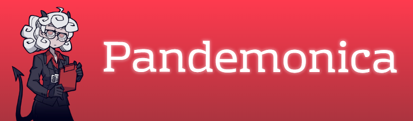
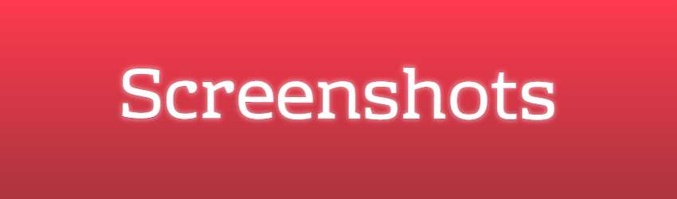
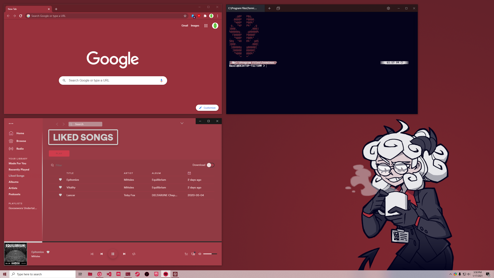
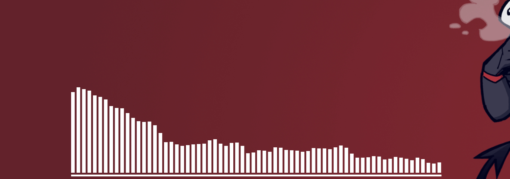
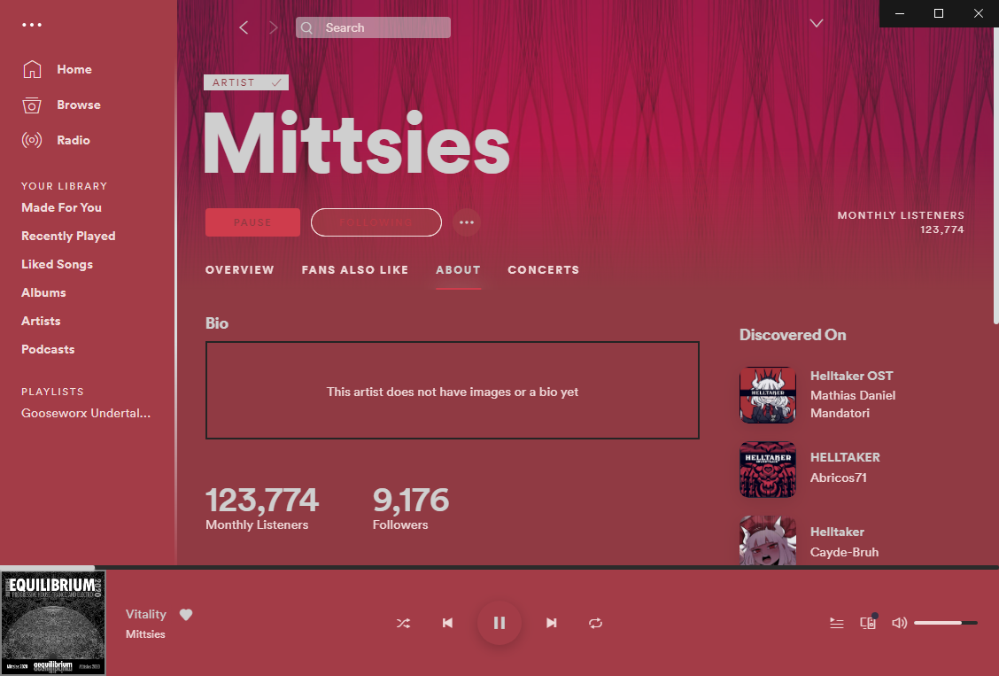
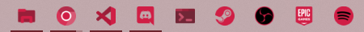
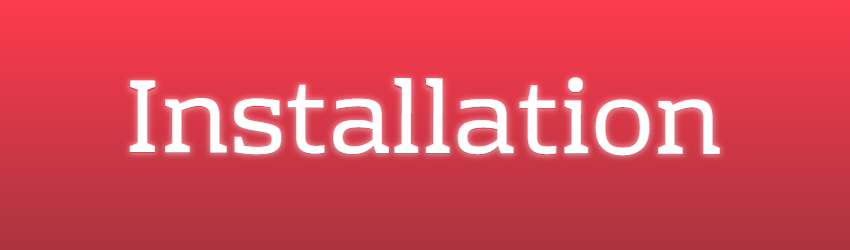
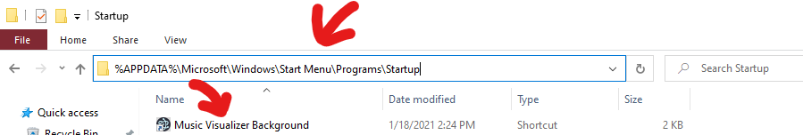
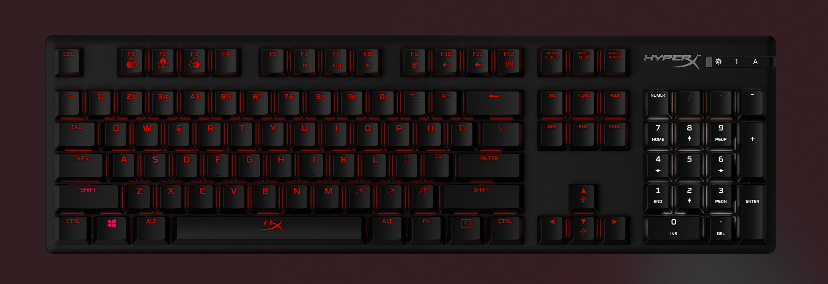

# ☕ My Windows 10 Theme

I've recently played Helltaker and loved it, so I decided to theme my desktop in a matching way.

# 

- Multiple custom icons, in svg, png, and ico format
- Custom audio visualizer wallpaper on boot built with Electron
- A simple to install themepack
- Usable on non activated Windows 10
- A theme for Spotify
- Various other small themes for things

# 

# 

Sadly there isn't an install script, so you'll have to do this manually :/

Download the latest and greatest release.zip from the releases, and extract it to a folder somewhere, say a hidden folder in your home directory where you won't have to stare at it, e.g. `.pandemonica`

Open the folder and doubleclick the `pandemonica.themepack` file, and it should apply the accent color and wallpaper automagically for you.

The icons are a little harder to do. For every app that you want, make a new shortcut for it, then right click > Properties > Shortcut > Change Icon, and browser to the folder you made and go into the icons directory and select an icon from there. Then, drag the shortcut to your taskbar and ~voila~, you have a custom icon. Note that not all apps will allow you to make a shortcut for them, e.g. the Windows Terminal app.

For the audio visulizer wallpaper, it's just an exe that displays an image and an audio visualizer. You can run the `setup.exe` file in the `music-visualizer` folder to install it as a desktop app, or use the .exe in the `unpacked` folder as a standalone file. To set it up to launch at boot, you make a shortcut to the app or .exe and place it in your startup folder, which you can access by typing `%APPDATA%\Microsoft\Windows\Start Menu\Programs\Startup` in the file explorer. Now, everytime you launch, the shortcut will be executed and the app will launch.

The Spotify theme requires [spicetify-cli](https://github.com/khanhas/spicetify-cli). Follow the install instructions for spicetify, and once you have it installed, place the `Pandemonica Spicetify` folder into `.spicetify/Themes` (rename it to just "Pandemonica" and use that as the theme name), select the theme in `.spicetify/config.ini` and run `spicetify apply` in the terminal you installed it from.

# 

- HyperX Keyboard Preset

Import `keyboard.hxp` (located in the `extras` folder) into Ngenuity, which is the HyperX RGB software.

# 

## The audio visualizer is so slooooow

I don't know if I can fix this, since it's an electron app that gets the audio output and renders it on a canvas with an image as well. I have just a little bit of delay, but it probably depends on your computer specs.

## The cropping and resolution is wierd

This theme was made for a computer with a resolution of 2560 x 1440, so I might not have accounted for other sizes.

## You said the Windows Terminal app can't have a custom icon, so why do you have it?

Plot twist; I don't. I switched to Terminus after pulling my hair out and inevitabely realising that it just wasn't possible, and it just looked better on Terminus than a red colored version of its logo.

# 

- [ ] Balance & Brighten the colors of the terminal icon
- [ ] Change the size of the inner circle for the Chrome icon
- [ ] Make install script (Java for the extra luls)
- [ ] Chrome theme, just changing color, *maybe* logo