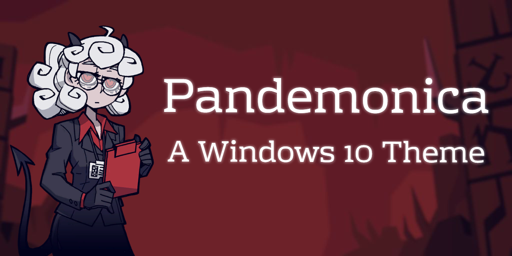
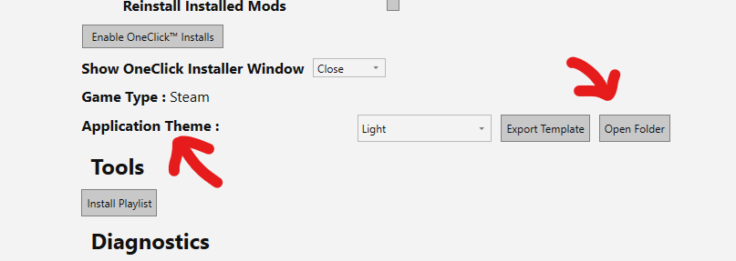
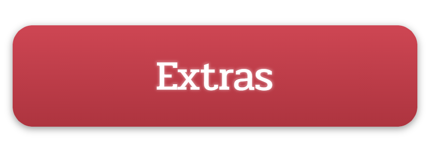
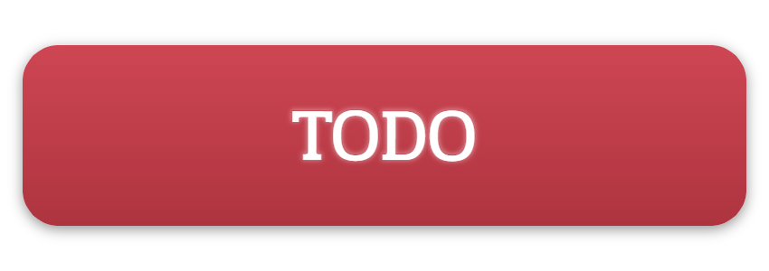

# ☕ Pandemonica - A Windows 10 Theme

[Screenshots](https://github.com/GunnerBasil/WinDemonica/blob/master/screenshots.md) • [Features](#features) • [Installation](#installation) • [Extras](#extras) • [FAQ](#faq) • [Support](#support)

# 

- 🔴 10+ icons remastered in glorious, red svg
- 🎶 Custom audio visualizer wallpaper on boot built with Electron
- 🔢 A simple to install themepack
- 💸 Usable on non activated Windows 10
- 🎧 A theme for Spotify
- 🙌 Many supported apps
- ☕ Coffee & Demons

## Supported apps

- VS Code
- Spicetify (Spotify)
- ModAssistant (Beat Saber modding utility)

# 

Sadly there isn't an install script, so you'll have to do this manually :/ (For now)

Download the latest and greatest release.zip from the releases, and extract it to a folder somewhere, say a hidden folder in your home directory where you won't have to stare at it, e.g. `.pandemonica`

### Themepack
Open the folder and doubleclick the `pandemonica.themepack` file, and it should apply the accent color and wallpaper automagically for you.

### Icons
The icons are a little harder to do. For every app that you want, make a new shortcut for it, then right click > Properties > Shortcut > Change Icon, and browser to the folder you made and go into the icons directory and select an icon from there. Then, drag the shortcut to your taskbar and voila, you have a custom icon. Note that not all apps will allow you to make a shortcut for them, e.g. the Windows Terminal app.

### Background
For the audio visulizer wallpaper, it's just an exe that displays an image and an audio visualizer. You can run the `setup.exe` file in the `music-visualizer` folder to install it as a desktop app, or use the .exe in the `unpacked` folder as a standalone file. To set it up to launch at boot, you make a shortcut to the app or .exe and place it in your startup folder, which you can access by typing `%APPDATA%\Microsoft\Windows\Start Menu\Programs\Startup` in the file explorer. Now, everytime you boot up, the shortcut will be executed and the app will launch. Your desktop icons will not show thow, since it's a window that you can't click on that would be over the desktop.

### VS Code
The Visual Studio Code theme is pretty easy to install. Move the `vscode-theme` folder to `.vscode\extensions` in your home folder. Then, restart Visual Studio Code and open the command panel (Ctrl+Shift+P). Type `Preferences: Color Theme`, and then switch your theme to "Pandemonica."

### Spotify/Spicetify
The Spotify theme requires [spicetify-cli](https://github.com/khanhas/spicetify-cli). Follow the install instructions for spicetify, and once you have it installed, place the `Pandemonica Spicetify` folder into `.spicetify/Themes` (rename it to just "Pandemonica" and use that as the theme name), select the theme in `.spicetify/config.ini` and run `spicetify apply` in the terminal you installed spicetify from.

### ModAssistant
Move the file `pandemonica.mat` into your theme directory, which you can find in the settings panel. If it says that "Themes folder not found! Try exporting the template..." then you'll need to press the `Export Template` button, which will create the folder for you. Then, you can press the `Open Folder` button again in order to open the folder and move `pandemonica.mat` into it.

# 

HyperX Keyboard Preset

Import `keyboard.hxp` (located in the `extras` folder) into Ngenuity, which is the HyperX RGB software.

# 

### The audio visualizer is so slooooow

I don't know if I can fix this, since it's an electron app that gets the audio output and renders it on a canvas with an image as well. I have just a little bit of delay, but it probably depends on your computer specs.

### The cropping and resolution is wierd

This theme was made for a computer with a resolution of 2560 x 1440, so I might not have accounted for other sizes.

### You said the Windows Terminal app can't have a custom icon, so why do you have it?

Plot twist; I don't. I switched to Terminus after pulling my hair out and inevitably realising that it just wasn't possible, and it just looked better on Terminus than a red colored version of its logo.

# 

- [ ] Balance & Brighten the colors of the terminal icon
- [ ] Change the size of the inner circle for the Chrome icon
- [ ] Make install script (Java for the extra luls)
- [ ] Chrome theme, just changing color, *maybe* logo
- [x] Figure out vscode themes, make that from pywal
- [ ] OBS skin
- [ ] Powershell theme install instructions + add to release
- [x] Mod Assistant theme

# 

DISCLAIMER: I didn't make any of these sprites (duh), go check out [@Vanripper](https://twitter.com/vanripperart).

Like what you see? Want to continue support development?

- ⭐️ Star [WinDemonica](https://github.com/GunnerBasil/WinDemonica) on GitHub and appear down below
- 🐕 DogeCoin: `DT5x3uYum5tsXMHx1Nt9uYfAocd2tK643S`
- 🔹 Etherium: `0xFeDD9ed1a988Bc8e002aCE54dDe6F2f93C0e730E`
- 🦁 Send a tip with Brave browser, on [the Github](https://github.com/GunnerBasil/WinDemonica)

